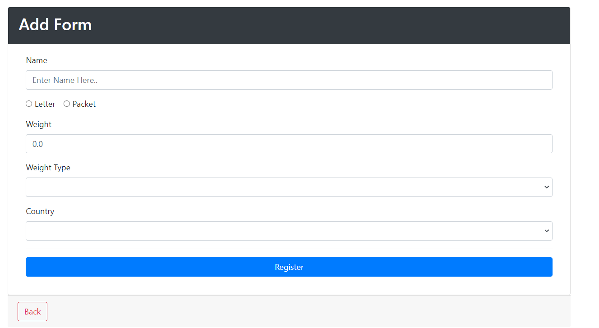
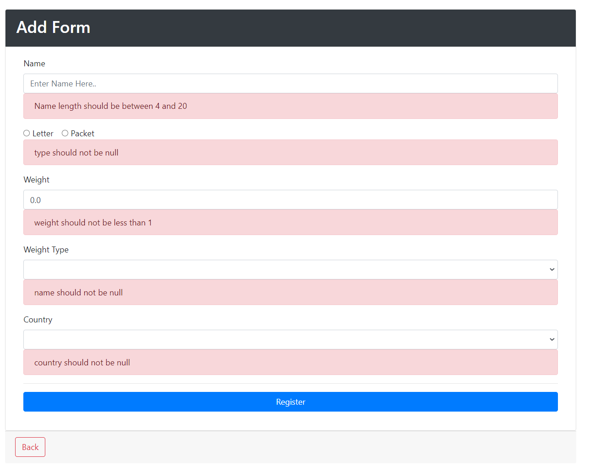
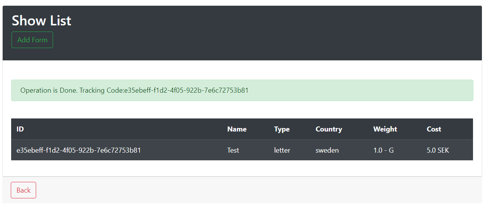
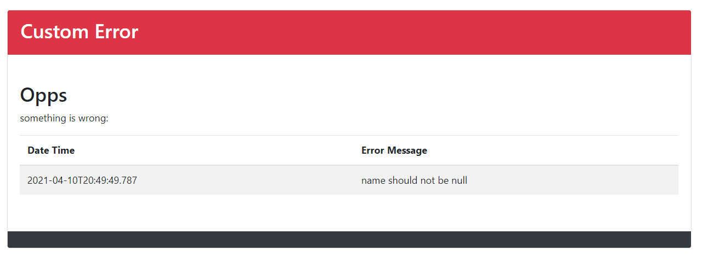
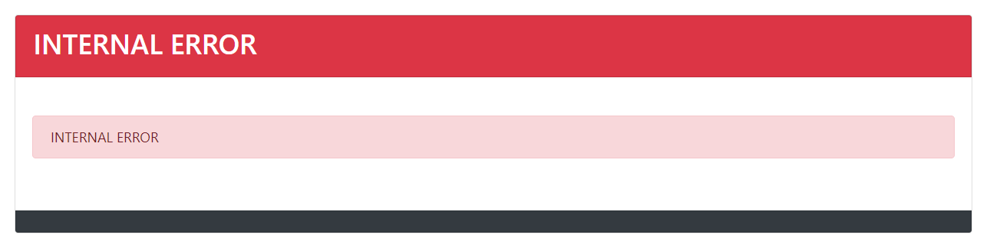

#Shipping Cost Calculating App
##App Pages
1. AddBoxForm
2. ShowBoxList
3. SearchBox 
4. Error
5. Custom Error
   
###Frameworks:
- Spring Boot Dev Tools
- Spring Boot Web
- Spring Data JPA
- Validation
- Thymeleaf
- MySql
- H2
- bootstrap
- Unit test

####Functionalities:
- Implement CRUD Operations
- Implement Validation for AddBoxForm
- Calculate shipping cost
    - Country Multipliers
        - Sweden: 2.5
        - Australia: 7
    - Weight Type
        - KG: 1000 SEK
        - G: 2 SEK
- Implement **Exception Handling**


######Class Variables
```
String id;
String name;
String country;
String type;
double cost;
double weight;
String weightType;
LocalDateTime createDate;
boolean status;
```


###Add Form

###Validation Add Form

###Show List

###Custom Error

###Global Error or Internal Error
